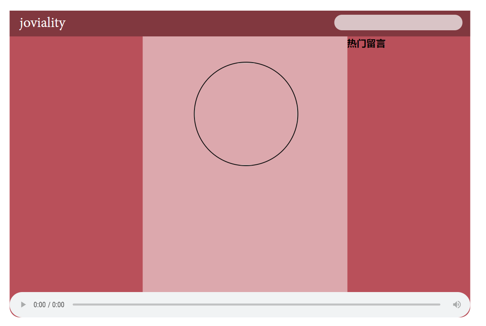
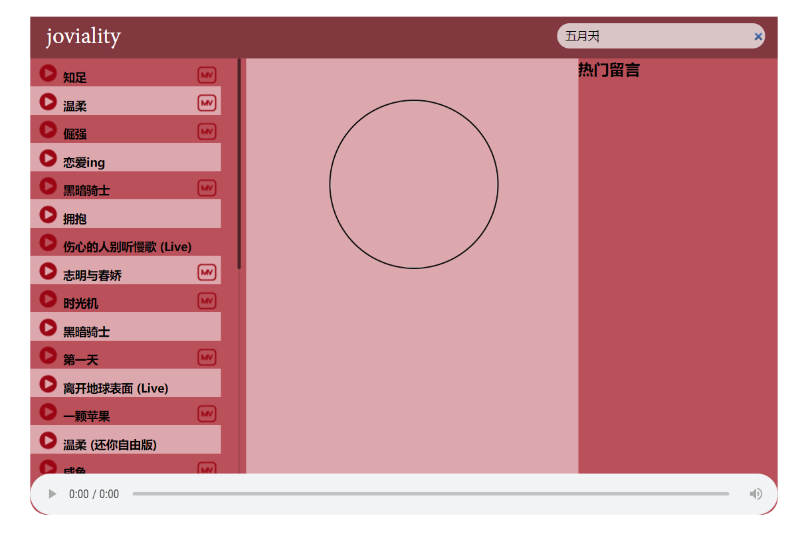
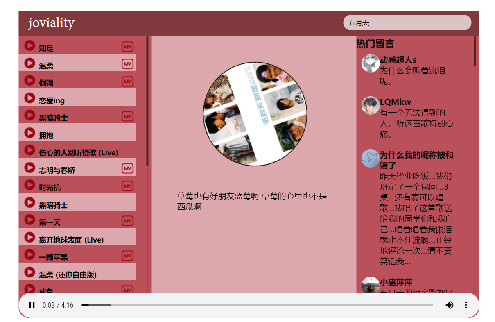
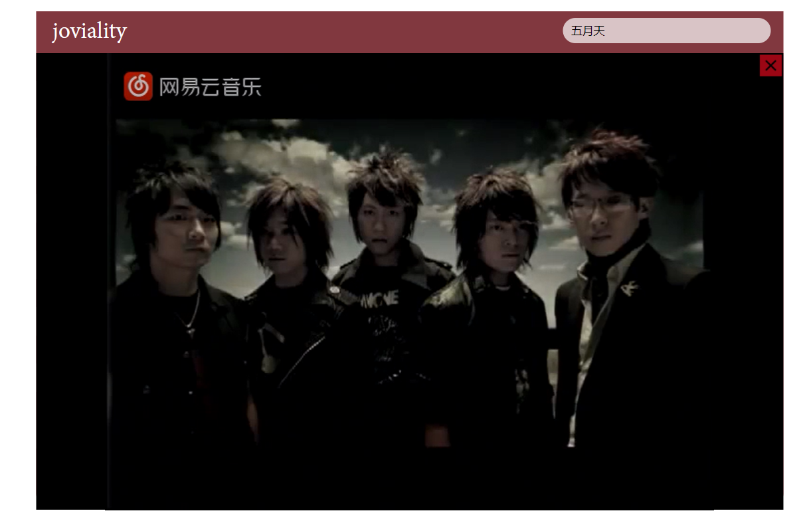

## 音乐播放器

该项目是一个基于vue写的音乐播放器，使用了axios请求音乐播放的接口，axios是对ajax的封装

首页：对播放器进行了简单的布局

音乐搜索：当输入音乐或者音乐人之后，根据搜索内容请求到该接口，将请求到的歌曲内容，渲染到

左侧的列表之中

点击播放单曲：当点击歌曲旁边的播放按钮时，根据该歌曲的id请求到对应的歌曲，获取该歌曲的url将他赋值给audio标签的src这样就实现了歌曲的播放，在播放的同时还获取到了歌曲的封面和热门评论，因为避免中间的封面过于空，调用了一个伤痛文学的接口

点击播放mv:这里不是所有的歌曲都会显示mv图标，只有该歌曲请求的数据里面存在mvid时才显示图标，点击歌曲左侧的mv图标，播放歌曲mv,同时也要停止歌曲的播放，mv部分的显示和隐藏用的是v-if

利用v-if显示隐藏是直接创建和删除的特性，如果是使用v-show当我在关闭mv后，只是将mv部分隐藏了

并没有销毁，mv还是会继续播放，产生bug

还使用了一些美化界面的插件scrollbar，改变缓动条的样式